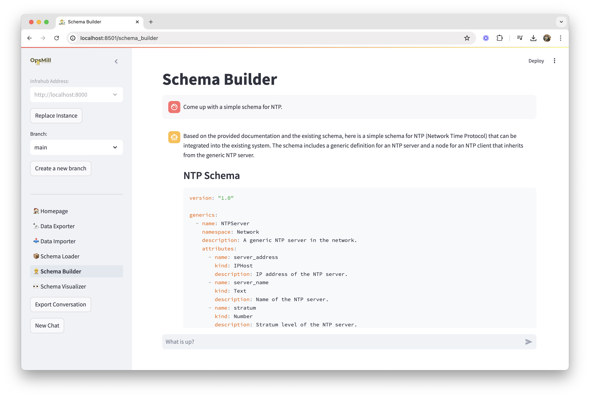

# Emma

Emma is an agent designed to help you interact with Infrahub.

Currently Emma can help you to :

- Import CSV Data into Infrahub
- Export Data from Infrahub in CSV format
- Build, Load and Visualize Infrahub schema


## Quick start

```console
poetry install
streamlit run main.py
```

Emma is using Infrahub standard environment variables to connect to Infrahub `INFRAHUB_ADDRESS` & `INFRAHUB_API_TOKEN`

```console
export INFRAHUB_ADDRESS="http://localhost:8000"
export INFRAHUB_API_TOKEN="06438eb2-8019-4776-878c-0941b1f1d1ec"
```

## Screenshots




